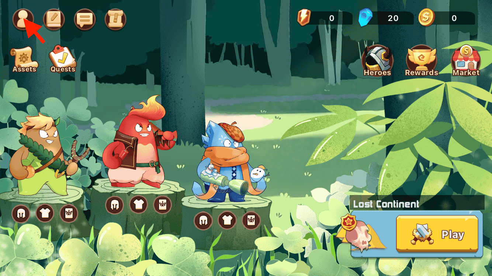
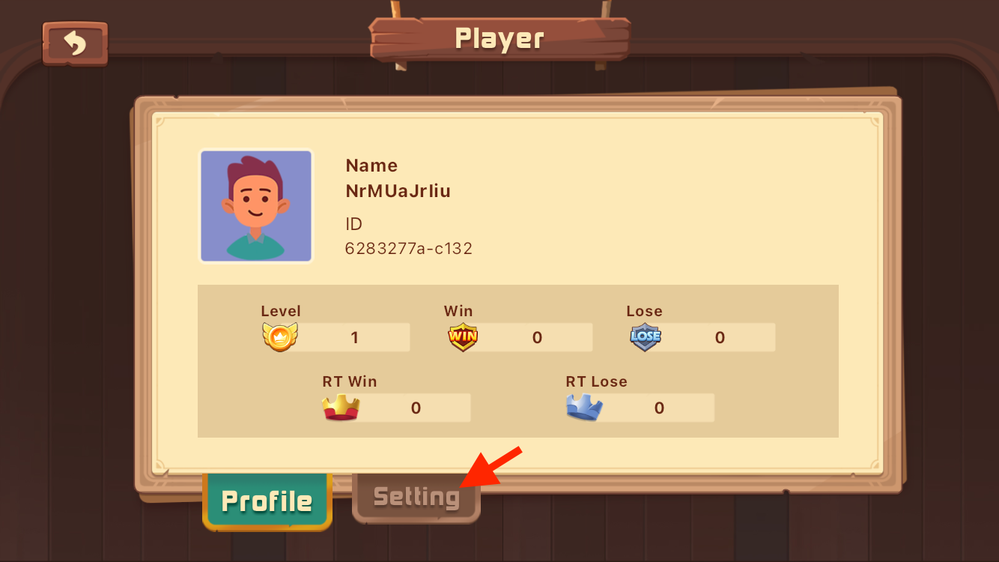
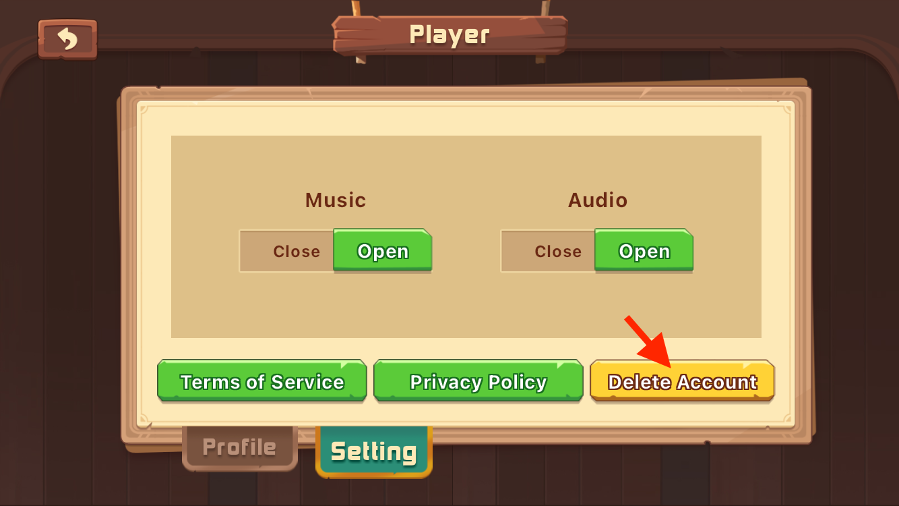

### Delete Account and Data

**Thank you for being part of the Elf Clash adventure!**

This page provides guidance on deleting your account and data in **Elf Clash**.

**Important Information**

Before proceeding, please acknowledge and understand the following:

* Account and data deletion is irreversible.

* Upon deletion, all in-game assets will be permanently lost.

* Deleting your account does not entitle you to a refund.

For details on data protection, refer to our Privacy Policy:
[Privacy Policy](https://www.ripengo.com/privacy_policy.html)

**CONTACT US**

If you have any queries, reach out to us:

- Controller: RipenGo Games
- Game: Elf Clash
- Email: service@ripengo.com

**Deletion Procedure**

1. Navigate to the main screen and click the Profile icon in the upper left corner.
  

2. Access the Settings tab.

  

3. Click the "Delete Account" button.
  